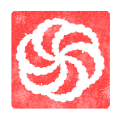

  
   

  My solutions for codewars.com

  
  
  

# Codewars solutions

Codewars solutions that were created by me.  
Using these solutions are not recommended until you solve the Kata by yourself.  
Don't sumbit these solutions as your own.  

> Contributions are not accepted.